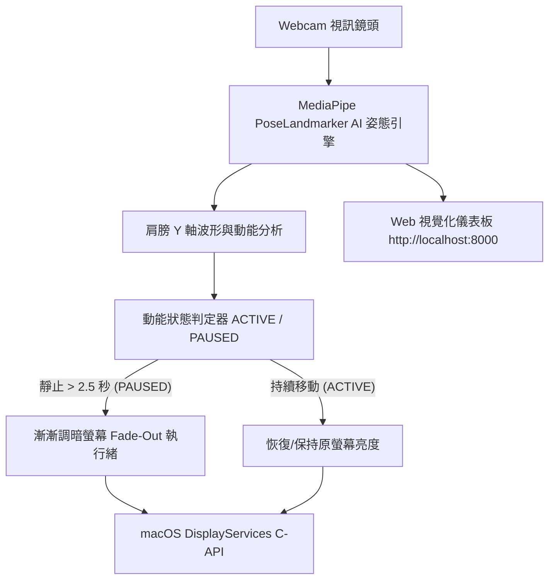

# 🏋️‍♂️ FitDimmer - macOS 肩膀動態感應螢幕調暗器

> 透過 AI 姿態辨識監測肩膀運動。持續律動維持螢幕亮度，一旦停止活動，螢幕隨即平滑調暗，督促你保持動態與健康！


---

## 🌟 亮點功能

- 🤖 **AI 姿態與肩膀動態追蹤**：整合 Google MediaPipe Pose 深度學習模型，精準定位左右肩關鍵點 (Keypoints 11 & 12)，辨識雙肩規律上下擺動、聳肩、深蹲與熱身律動。
- ☀️ **macOS 原生螢幕漸變調暗**：呼叫 macOS 原生 `DisplayServices` C-API，靜止時平滑調暗螢幕（自動 Fade-Out 至 5%），活動時即刻流暢回復亮度。
- 🎨 **現代化玻璃擬物 Web 儀表板**：使用 FastAPI + WebSockets 提供實時相機串流、姿態骨架與動能量表 HUD 畫面。
- ⚙️ **即時參數微調**：可在 Web UI 上動態調整觸發靜止秒數 (1.0s~10.0s)、肩膀移動靈敏度、漸變速度與最低螢幕亮度。
- 🛡️ **安全復原機制**：註冊 macOS 信號與關閉 Hook，程式結束或中斷 (Ctrl+C) 時自動將螢幕復原至原本亮度。

---

## 🏗️ 系統架構



---

## 🚀 快速開始

### 1. 複製專案與進入目錄

```bash
git clone https://github.com/tttt1314/-FitDimmer.git
cd -FitDimmer
```

### 2. 執行一鍵啟動腳本

```bash
./run_fitdimmer.sh
```

> **說明**：腳本會自動建立 Python 虛擬環境 (`.venv_fitdimmer`) 並安裝所需套件 (`opencv-python-headless`, `mediapipe`, `fastapi`, `uvicorn`, `jinja2`)。

### 3. 開啟 Web 儀表板

啟動後請開啟瀏覽器訪問：

**👉 [http://localhost:8000](http://localhost:8000)**

---

## 📁 專案檔案結構

```
.
├── app.py                   # FastAPI 主伺服器與鏡頭處理迴圈
├── pose_detector.py         # MediaPipe 肩動姿態與運動能量計算模組
├── brightness_controller.py # macOS 原生硬體螢幕調暗與流暢漸變模組
├── run_fitdimmer.sh         # 一鍵啟動與環境初始化腳本
├── requirements.txt         # Python 依賴套件清單
├── templates/
│   └── index.html           # 視覺化深色模式 UI (HTML5/CSS3/WebSocket)
└── pose_landmarker.task     # MediaPipe Pose 神經網路模型
```

---

## 🛠️ 開發與依賴套件

- **macOS** 11.0 (Big Sur) 以上
- **Python** 3.10 / 3.11 / 3.12 / 3.14
- **Core Libraries**: `opencv-python-headless`, `mediapipe`, `fastapi`, `uvicorn`, `jinja2`, `websockets`

---

## 📜 授權條款

本專案採用 [MIT License](LICENSE) 釋出。歡迎自由修改與分享！
